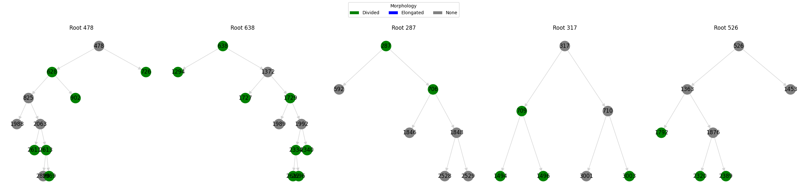

# Lineage-Tree-Analysis
Visualized cell lineage trees from tracking data and analyzed cell division patterns.

# Steps Performed
1. Loaded lineage data from CSV file
    - Import Libraries
    - Load Data
2. Created tree diagrams to visualize top 5 largest lineages with color-coded morphology.
    - Identify Root Cells (no parent)
    - Build Parent-Child Relationships (map)
    - Count Descendants (top 5)
    - Isolate the full family tree of each of the top 5 roots (subset)
    - Built a directed graph (nx.DiGraph) for each lineage
    - Plot all 5 trees
3. Calculated statistics: lifespan, division frequency, morphology distribution
    - Lifespan: Analyzed how long cells lived before dividing or dying
    - Division frequency: Measured how often cells divides
    - Morphology Distribution: Examined how many cells are divided vs. elongated

# Results
Lineage Tree for Root Cells

# Animation
Lineage Tree Animations

)

## Statistics
#### <i> LIFESPAN </i>
- Total no. of cells (for which lifespan was calculated:  8
- Avg lifespan of all cells: 				294.95
- Standard Deviation: 					802.97
- Shortest lived cell: 					0.0
- Longest lived cell: 					2282.0

Avg lifespans per lineage:
- Root id 478: 8.45 frames
- Root id 638: 8.18 frames
- Root id 287: 10.71 frames
- Root id 317: 9.14 frames
- Root id 526: 11.57 frames

#### <i> DIVISION FREQUENCY </i>
- Total Divisions: 882
- Total cells: 2282
- Division Frequency: 0.39

#### <i> MORPHOLOGY DISTRIBUTION </i>
- Morphology counts:
- Divided:   882
- Elongated: 162

Morphology percentages:
- Divided:   84.48
- Elongated: 15.52
